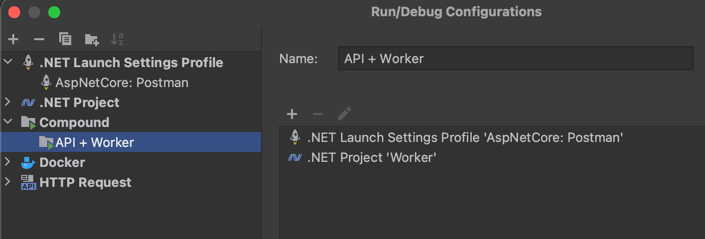

# IGroceryStore
[](https://github.com/Nairda015/IGroceryStore/actions/workflows/dotnet.yml)
### Loosely coupled monolith app where users will track personal basket price.

# Projects Structure:  


# Main features:
- Watching product prices over time
- Comparing basket price across stores
- Searching for allergens free products
- Rating products and stores
- Searching for similar products

# Modules:
## [Basket](https://github.com/Nairda015/IGroceryStore/tree/master/src/Baskets/Baskets.Core)
- Event Store for storing historical data about products prices and promotions
- MongoDb for storing projections

### [Available actions:](https://github.com/Nairda015/IGroceryStore/tree/master/src/Baskets/Baskets.Core/Features)
- Create Basket
- Consumers for creations of product and price changes

## [Users](https://github.com/Nairda015/IGroceryStore/tree/master/src/Users/Users.Core)
- Auth with JWT
- Refresh tokens handling
- BCrypt
- Postgres for storing users (I'm considering changing it to noSql)

### [Available actions:](https://github.com/Nairda015/IGroceryStore/tree/master/src/Users/Users.Core/Features)
- Register
- Login
- Refresh Token
- GetAll/GetUser

## [Shops](https://github.com/Nairda015/IGroceryStore/tree/master/src/Shops/Shops.Core)
- Storing shops location and current price of product
- calculating best basket price in shops near me (coming soon)

### [Available actions:](https://github.com/Nairda015/IGroceryStore/tree/master/src/Shops/Shops.Core/Features)
- Report new product price 

## [Products](https://github.com/Nairda015/IGroceryStore/tree/master/src/Products/Products.Core)
- Postgres for relational data
- Module publish events for other module about new product added
- I'm considering using apache lucene to enable searching for similar products

### [Available actions:](https://github.com/Nairda015/IGroceryStore/tree/master/src/Products/Products.Core/Features)
- Create Product
- Mark Product As Obsolete
- Add Allergens To Product
- CRUD for Categories
- CRUD for Allergens

# Stack  
[.Net7.0 C#11 with Minimal API](https://github.com/dotnet)  
[Docker](https://github.com/docker) - containerization for tests aln local development    
[Event Store](https://www.eventstore.com/) - storing historical data of products prices  
[MongoDb](https://www.mongodb.com/) - storing projections from historical data  
[DynamoDb](https://github.com/aws/aws-sdk-net) - storing data from shop module  
[AWS Systems Manager](https://github.com/aws/aws-dotnet-extensions-configuration/) - runtime configuration  
[JWT.Net](https://github.com/jwt-dotnet/jwt) - authorisation and authentication  
[BCrypt.net](https://github.com/BcryptNet/bcrypt.net) - password hasing  
[GitHubAction](https://github.com/Nairda015/IGroceryStore/blob/master/.github/workflows/dotnet.yml) - CI/CD  
[RabbitMQ](https://github.com/rabbitmq) - asynchronous messaging  
[PostgreSQL](https://github.com/postgres/postgres) - database with json support  
[Entity Framework Core](https://github.com/dotnet/efcore) - ORM used for product module  
[OpenTelemetry](https://opentelemetry.io) - Traces, Metrics  
[Jaeger](https://www.jaegertracing.io) - Exporter/UI for OpenTelemetry  


# For Contributors

## Git Branching Strategy
I'm using Feature Branch Workflow for simplicity and  
I encourage you to use it also in your fork.  
You can read more about flow [here](https://www.blog.techtious.com/tag/feature-branch-workflow/)

## How to run
- From the tools directory run the command:  
```docker-compose up -d```  
- Run ASP and Worker Project (add compound configuration in Rider)
-  //TODO: add in GH
- API endpoints: localhost:5000/swagger
- All ports for infrastructure available in docker-compose file
- To connect to pgadmin from docker use:  
```docker run -p 5050:80  -e "PGADMIN_DEFAULT_EMAIL=name@example.com" -e "PGADMIN_DEFAULT_PASSWORD=admin"  -d dpage/pgadmin4```  
